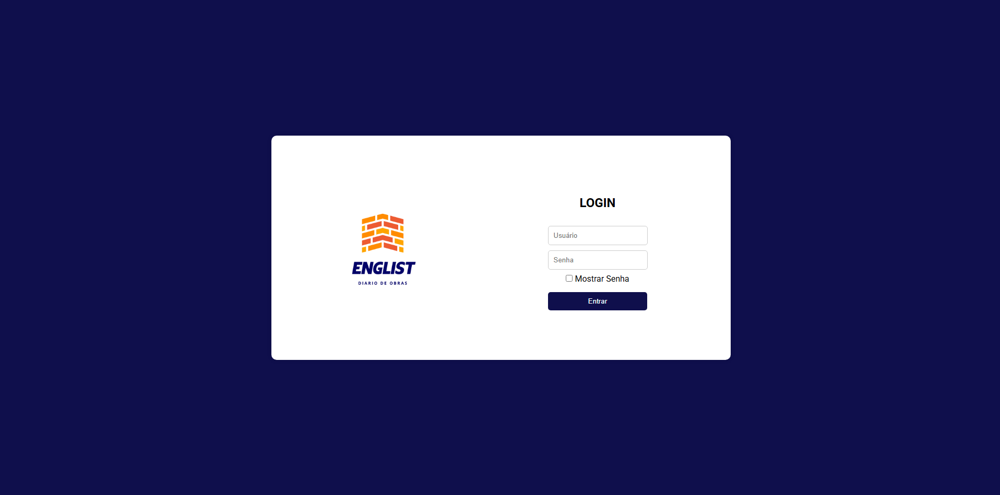
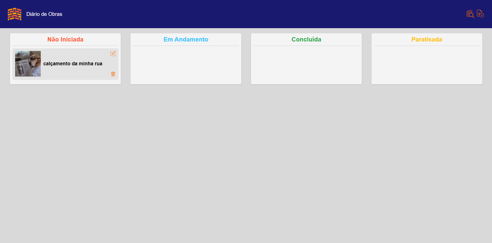
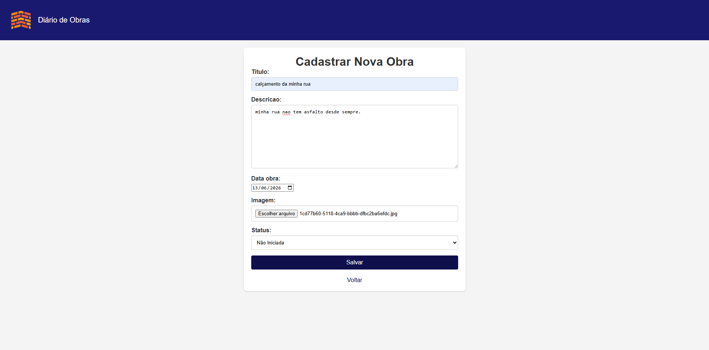

# EngList

Construction work management system built with Django, featuring a Kanban-style board for status tracking, image upload per work entry, and a REST API alongside the traditional web interface.

The project uses a single `core` app that serves both the web views and the API endpoints under separate URL namespaces — `/` for the Django templates and `/api/v1/` for the DRF endpoints. Image URLs in the API are returned as absolute URIs, making the endpoint ready for external consumption.

---

## Features

| Feature        | Description                                                                                          |
| -------------- | ---------------------------------------------------------------------------------------------------- |
| Kanban Board   | Works organized into four columns: Not Started, In Progress, Completed, and Stalled                  |
| Work CRUD      | Create, edit, review, and delete construction works with title, description, date, image, and status |
| Image Upload   | Image per work entry stored in the `media/` directory via Pillow                                     |
| Work Review    | Dedicated detail page for each work with full image display                                          |
| REST API       | DRF endpoints for listing, adding, updating, and removing works                                      |
| Authentication | Login required — only superusers can access the system                                               |

---

## API Endpoints

| Method | Endpoint                        | Description         |
| ------ | ------------------------------- | ------------------- |
| GET    | `/api/v1/obras/listar/`         | List all works      |
| PUT    | `/api/v1/obras/adicionar/`      | Add a new work      |
| POST   | `/api/v1/obras/atualizar/<id>/` | Update a work by ID |
| DELETE | `/api/v1/obras/remover/<id>/`   | Remove a work by ID |

---

## Screenshots

**Login**


**Kanban Board**


**Register Work**


---

## Project Structure

```
├── core/                      # Main app
│   ├── models.py              # Obra model (title, description, date, image, status)
│   ├── forms.py               # ObraForm with date picker and status selector
│   ├── views.py               # Web views and API endpoints
│   ├── serializers.py         # DRF serializer with absolute image URL
│   └── urls_api.py            # API routes (/api/v1/)
├── diario_de_obras/           # Django project config
│   ├── settings.py
│   └── urls.py
├── templates/                 # HTML templates
│   ├── login.html
│   ├── obras_listar.html      # Kanban board
│   ├── obras_cadastrar.html
│   ├── obras_editar.html
│   ├── obras_excluir.html
│   └── obras_revisar.html
├── static/
│   ├── css/                   # Per-page stylesheets
│   └── img/                   # Icons and logo
├── media/                     # Uploaded work images
├── docs/
│   └── screenshots/           # Project screenshots
├── manage.py
└── requirements.txt
```

---

## Technologies

**Backend**

- Python
- Django 5.1
- Django REST Framework 3.17
- django-cors-headers 4.9
- Pillow 12.3

**Frontend**

- HTML5
- CSS3 (per-page stylesheets, no framework)
- JavaScript (vanilla)

**Database**

- SQLite (local development)

---

## How to Run

**1. Clone the repository**

```bash
git clone https://github.com/luccaszzzz/diario_de_obras.git
cd diario_de_obras
```

**2. Create and activate the virtual environment**

```bash
python -m venv venv
# Windows
.\venv\Scripts\Activate
# Linux/Mac
source venv/bin/activate
```

**3. Install dependencies**

```bash
pip install -r requirements.txt
```

**4. Apply migrations**

```bash
python manage.py migrate
```

**5. Create a superuser**

```bash
python manage.py createsuperuser
```

**6. Start the server**

```bash
python manage.py runserver
```

Access at `http://127.0.0.1:8000/`

> Login requires a superuser account. Use the credentials created in step 5.

---

## Authors

- Lucas Emanoel da Silva Freitas
- Júlia Galvão
- Allan Bezerra
- Thalles Hermínio

---

[Leia em Português](README.pt-br.md)
